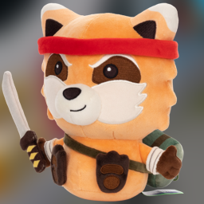

# 🧸 Naninhas Mod

## Project Zomboid Plushie Buffs

  

This mod introduces the concept of "naninhas" to AuthenticZ attachable plushies!

Each plushie will give a different bonus when attached to the backpack!

## Buffs

Each plushie grants a unique bonus when attached to your backpack. Only one plushie can be equipped at a time, and buffs are active while equipped.

| 🧸 **Plushie**              | ✨ **Effect /Buff**                                                                                                                           |
| --------------------------- | --------------------------------------------------------------------------------------------------------------------------------------------- |
| **🦡 Boris The Badger**     | Grants `Cats Eye's` trait (Better night vision)                                                                                               |
| **🧸 Doll**                 | Grants `Eagle Eyed` trait (better field of vision)                                                                                            |
| **🦩 Flamingo**             | Grants `Graceful` trait (Makes less noise when moving)                                                                                        |
| **🐇 Fluffyfoot The Bunny** | Grants `LightEater` trait (reduces the amount the player needs to eat)                                                                        |
| **🦊 Freddy The Fox**       | Grants `Inconspicous` trait (reduces the chance of being spotted by zombies)                                                                  |
| **🐿️ Furbert The Squirrel** | Grants `Outdoorsy` trait (This trait reduces the chance of catching a cold and lowers the chance of scratches from trees. Improves foraging.) |
| **👶 Green Sci-Fi Goblin**  | Grants `Fast Learner` trait (Increases XP gain)                                                                                               |
| **🐾 Moley The Mole**       | Slight boost to Foraging efficiency XP gain                                                                                                   |
| **🐶 Otis the Pug**         | Grants `Fast Reader` trait (Takes less time to read books)                                                                                    |
| **🦔 Pancake The Hedgehog** | Slight boost to sprinting and Agility XP gain                                                                                                 |
| **🐾 Jacques The Beaver**   | Slight boost to Carpentry XP gain                                                                                                             |
| **🦝 Spiffo**               | Grants bonus to endurance while equipped                                                                                                      |
| **🐾 Spiffo Blueberry**     | Grants `LowThirst` trait (You need to drink less water)                                                                                       |
| **🍒 Spiffo Cherry**        | Grants `Organized` trait                                                                                                                      |
| **🦝 Spiffo PAWS (Gray)**   | Slight boost to Nimble, Blades & Blunt XP gains                                                                                               |
| **❤️ Spiffo Heart**         | Slight boost to First Aid XP gain                                                                                                             |
| **🌈 Spiffo Rainbow**       | Small bonus to reduce Boredom, Fatigue and recover Fatigue                                                                                    |
| **🎅 Spiffo Santa**         | Reduces Boredom slowly                                                                                                                        |
| **🍀 Spiffo Shamrock**      | Slight boost to Aiming and Reloding XP gain                                                                                                   |
| **🐾 Substitution Doll**    | Grants `Brave` trait                                                                                                                          |
| **🐻 Toy Bear**             | Reduces Panic and Stress                                                                                                                      |
| **🐻 Toy Bear (Small)**     | Same as ToyBear but slightly lower effect                                                                                                     |

## Useful links

- [Umbrella](https://github.com/asledgehammer/Umbrella) - Lua script code completion for Zomboid API

## Stats
### Code coverage
<table>
  <thead>
    <tr>
      <td><strong>MAIN</strong></td>
      <td><strong>RELEASE</strong></td>
    </tr>
  </thead>
  <tbody>
    <tr>
      <td>
        
      </td>
      <td>
        
      </td>
    </tr>
  </tbody>
</table>