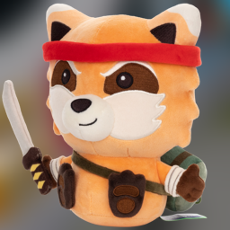
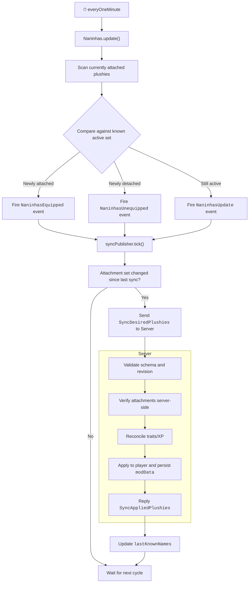
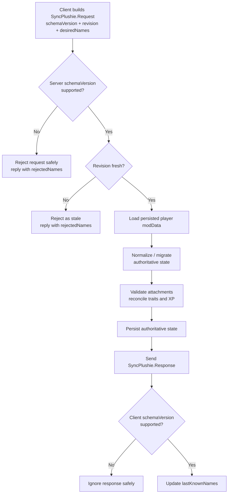

# 🧸 Naninhas Mod

## Project Zomboid Plushie Buffs

<p align="center">
  
</p>

> **Naninha** is a Portuguese term for a child's comfort plushie or emotional support toy, the kind of soft companion many children keep close for reassurance.

This mod adds "naninhas" style bonuses to Authentic Z attachable plushies. Each plushie grants a different bonus while attached to a backpack.

## Requirements

This mod requires one of the **[Authentic Z](https://steamcommunity.com/sharedfiles/filedetails/?id=2335368829)** mods that allow attachable items:
- Authentic Z (full mod)
- AuthenticZBackpacks+ (only the backpacks)

## Links

- [Steam Workshop](https://steamcommunity.com/sharedfiles/filedetails/?id=3624617298)
- [Nexusmods](https://www.nexusmods.com/projectzomboid/mods/338)
- [GitHub Repository](https://github.com/dihgg/naninhas)

## 🦸‍♀️ Support!
<hr/>
<br/>
<p align="center">
  <strong>Found this mod fun or useful? You can support its development!</strong>
</p>
<p align="center">
  <a href="https://buymeacoffee.com/dihgg">
    
  </a>
</p>
<hr/>

## ✊ Buffs

Each plushie grants a unique bonus while attached to your backpack.

| 🧸 **Plushie**              | ✨ **Effect /Buff**                                                                                                                           |
| --------------------------- | --------------------------------------------------------------------------------------------------------------------------------------------- |
| **🦡 Boris The Badger**     | Grants the `Cat's Eyes` / `NightVision` effect for better night vision                                                                        |
| **🧸 Doll**                 | Grants `Eagle Eyed` and suppresses `Short Sighted`                                                                                            |
| **🦩 Flamingo**             | Grants `Graceful` and suppresses `Clumsy`                                                                                                     |
| **🐇 Fluffyfoot The Bunny** | Grants `Light Eater` and suppresses `Hearty Appetite`                                                                                         |
| **🦊 Freddy The Fox**       | Grants `Inconspicuous` and suppresses `Conspicuous`                                                                                           |
| **🐿️ Furbert The Squirrel** | Grants `Outdoorsman`                                                                                                                          |
| **👶 Green Sci-Fi Goblin**  | Grants `Fast Learner` and suppresses `Slow Learner`                                                                                           |
| **🐾 Moley The Mole**       | Adds +2 `Plant Scavenging` XP multiplier while equipped                                                                                       |
| **🐶 Otis the Pug**         | Grants `Fast Reader` and suppresses `Slow Reader`                                                                                             |
| **🦔 Pancake The Hedgehog** | Adds +1 `Sprinting` and +1 `Agility` XP multipliers while equipped                                                                           |
| **🐾 Jacques The Beaver**   | Adds +1 `Woodwork` XP multiplier while equipped                                                                                               |
| **🦝 Spiffo**               | Periodically restores endurance while equipped                                                                                                |
| **🐾 Spiffo Blueberry**     | Grants `Low Thirst` and suppresses `High Thirst`                                                                                              |
| **🍒 Spiffo Cherry**        | Grants `Organized` and suppresses `Disorganized`                                                                                              |
| **🦝 Spiffo PAWS (Gray)**   | Adds +1 `Nimble`, `Long Blade`, `Small Blade`, `Blunt`, and `Small Blunt` XP multipliers while equipped                                     |
| **❤️ Spiffo Heart**         | Adds +2 `Doctor` / First Aid XP multiplier while equipped                                                                                     |
| **🌈 Spiffo Rainbow**       | Periodically reduces boredom, restores endurance, and reduces fatigue                                                                         |
| **🎅 Spiffo Santa**         | Periodically reduces boredom                                                                                                                  |
| **🍀 Spiffo Shamrock**      | Adds +5 `Aiming` and +5 `Reloading` XP multipliers while equipped                                                                             |
| **🐾 Substitution Doll**    | Grants `Brave` and suppresses `Desensitized`, `Cowardly`, `Agoraphobic`, and `Claustrophobic`                                                |
| **🐻 Toy Bear**             | Periodically reduces panic                                                                                                                    |
| **🐻 Toy Bear (Small)**     | Periodically reduces panic, with a smaller effect than Toy Bear                                                                               |

---

## 🌎 Translations
Available languages for **Naninhas**
### 🇧🇷 Brazilian Portuguese
- [Steam workshop](https://steamcommunity.com/sharedfiles/filedetails/?id=3737445801)
- [Nexusmods](https://www.nexusmods.com/projectzomboid/mods/340)
---

# Development
## 🌎 Translations

Translations are maintained in JSON under [src/translations-json](src/translations-json).

During `npm run postbuild`:
- Build 42 output is generated as `.json` files in `42/media/lua/shared/Translate/<LANG>/<NAMESPACE>.json`

## 👩‍💻 API
Other mods can interact with **Naninhas** through its custom `Events` hooks.

### Equipped / Unequipped / Update
Each plushie triggers custom events that other mods can listen to.
```lua
  Events.NaninhasEquipped.Add(function(data) end)

  Events.NaninhasUnequipped.Add(function(data) end)

  Events.NaninhasUpdate.Add(function(data) end)
```

In TypeScript, this looks like:

```typescript

import * as Events from "@asledgehammer/pipewrench-events";
import { EventsEnum } from "@constants";
import type { EventData } from "@types";

new Events.EventEmitter<( data: EventData ) => void>(EventsEnum.Equipped).addListener((data) =>{});

new Events.EventEmitter<( data: EventData ) => void>(EventsEnum.Unequipped).addListener((data) =>{});

new Events.EventEmitter<( data: EventData ) => void>(EventsEnum.Update).addListener((data) =>{});
```

The `data` payload has the following structure:

| Property | Type | Description |
|----------|-------|------------|
| name | `string` | The plushie name |
| addedTraits | `Array<string>` | Traits granted by the plushie |
| suppressedTraits | `Array<string>` | Traits suppressed by the plushie |
| xpBoosts | `Table<string,number>` | XP boosts keyed by perk name |


---


## Architecture

Naninhas uses a **unified server-authoritative model** for both game modes (single player / multiplayer).

**Key principles:**
- Client detects attachment changes and publishes desired plushie set
- Server validates and reconciles trait/XP state authoritatively
- Observer pattern handles event emission for external mods
- Trait and XP application is **ALWAYS** server-side, never client-side

### Logic Flow


```mermaid
flowchart TD
    T["⏱ everyOneMinute"] --> U["Naninhas.update()"]
    U --> C["Scan currently attached plushies"]
    C --> D{"Compare against known active set"}
    D -->|Newly attached| E["Fire <code>NaninhasEquipped</code> event"]
    D -->|Newly detached| F["Fire <code>NaninhasUnequipped</code> event"]
    D -->|Still active| G["Fire <code>NaninhasUpdate</code> event"]
    E --> H["syncPublisher.tick()"]
    F --> H
    G --> H
    H --> I["Attachment set changed since last sync?"]
    I -->|No| J["Wait for next cycle"]
    I -->|Yes| K["Send <code>SyncDesiredPlushies</code> to Server"]
    K --> L["Validate schema and revision"]
    subgraph Server
    L --> M["Verify attachments server-side"]
    M --> N["Reconcile traits/XP"]
    N --> O["Apply to player and persist <code>modData</code>"]
    O --> P["Reply <code>SyncAppliedPlushies</code>"]
    end
    P --> Q["Update <code>lastKnownNames</code>"]
    Q --> J
```

### Single Player

In single player, plushie buffs are still applied *server-authoritatively*, because the local game process also runs the server logic.

### Multiplayer

Multiplayer introduces latency, so the flow must tolerate stale and out-of-order requests. Naninhas handles this with a monotonic `revision` number tracked by both client and server.

Project Zomboid typically prevents clients with different installed mod versions from joining the same server. Even so, Naninhas still treats `schemaVersion` as a transport guard so incompatible request or response payloads are rejected safely instead of being processed accidentally.

### Network Contract

Module: `Naninhas`

Client to server command: `SyncDesiredPlushies`

| Field | Type | Description |
|---|---|---|
| schemaVersion | `number` | Protocol compatibility version |
| revision | `number` | Monotonic client sync counter |
| desiredNames | `string[]` | Desired active plushie names from current attachments |

Server to client command: `SyncAppliedPlushies`

| Field | Type | Description |
|---|---|---|
| schemaVersion | `number` | Echoed protocol version |
| revision | `number` | Echoed request revision |
| appliedNames | `string[]` | Names accepted and applied by server |
| rejectedNames | `string[]` | Names rejected by validation |

Validation behavior:
- Unsupported request `schemaVersion` is rejected by the server before domain logic runs.
- Unsupported response `schemaVersion` is ignored by the client.
- Stale `revision` is rejected to avoid out-of-order application.
- Unknown plushie names are rejected.
- Server verifies plushies are actually attached before applying.

### Transport vs Persisted Data

There are two separate compatibility concerns in this architecture:

1. **Transport schema**: the shape of request/response payloads sent over `sendClientCommand` / `sendServerCommand`.
2. **Persisted data schema**: the shape of authoritative state stored in player `modData` across saves and mod updates.

These are intentionally handled differently:

- Transport schema mismatches are rejected or ignored immediately at the network boundary.
- Persisted `modData` is normalized and migrated on load through the server handler migration path.


```mermaid
flowchart TD
  A["Client builds SyncPlushie.Request\nschemaVersion + revision + desiredNames"] --> B{"Server schemaVersion\nsupported?"}
  B -->|No| C["Reject request safely\nreply with rejectedNames"]
  B -->|Yes| D{"Revision fresh?"}
  D -->|No| E["Reject as stale\nreply with rejectedNames"]
  D -->|Yes| F["Load persisted player modData"]
  F --> G["Normalize / migrate\nauthoritative state"]
  G --> H["Validate attachments\nreconcile traits and XP"]
  H --> I["Persist authoritative state"]
  I --> J["Send SyncPlushie.Response"]
  J --> K{"Client schemaVersion\nsupported?"}
  K -->|No| L["Ignore response safely"]
  K -->|Yes| M["Update lastKnownNames"]
```

## 👩‍💻 Repository Badges
### Code Coverage
<table>
  <thead>
    <tr>
      <td><strong>MAIN</strong></td>
      <td><strong>RELEASE</strong></td>
    </tr>
  </thead>
  <tbody>
    <tr>
      <td>
        <a href="https://codecov.io/gh/dihgg/naninhas" target="_blank">
          
        </a>
      </td>
      <td>
        <a href="https://codecov.io/gh/dihgg/naninhas" target="_blank">
          
        </a>
      </td>
    </tr>
  </tbody>
</table>