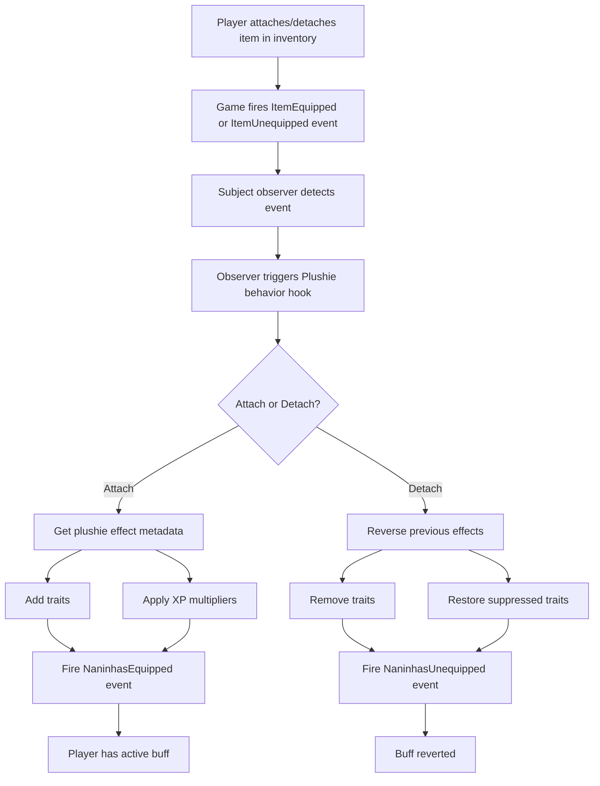
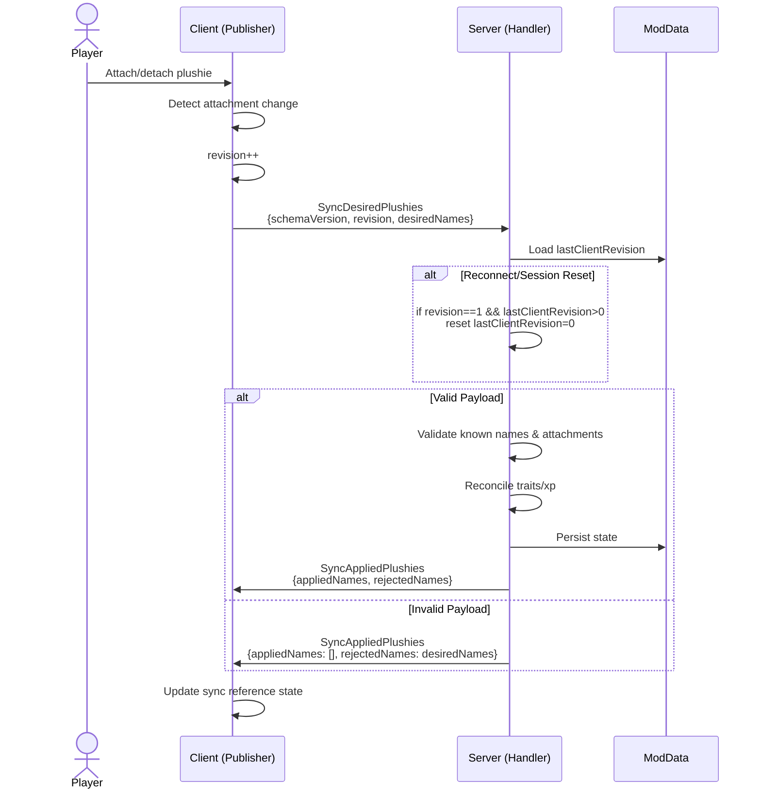

# 🧸 Naninhas Mod

## Project Zomboid Plushie Buffs

<p align="center">
  
</p>

This mod introduces the concept of "naninhas" to AuthenticZ attachable plushies!

Each plushie will give a different bonus when attached to the backpack!

## Requirements

This mod requires one of the **[Authentic Z](https://steamcommunity.com/sharedfiles/filedetails/?id=2335368829)** mods that allows attachable items, either:
- Authentic Z (full mod)
- AuthenticZBackpacks+ (only the backpacks)

## Links

- [Steam Workshop](https://steamcommunity.com/sharedfiles/filedetails/?id=3624617298)
- [GitHub Repository](https://github.com/dihgg/naninhas)


## 🦸‍♀️ Support!
<hr/>
<br/>
<p align="center">
  <strong>Found this mod fun or useful? You can support its development!</strong>
</p>
<p align="center">
  <a href="https://buymeacoffee.com/dihgg">
    
  </a>
</p>
<hr/>

## ✊ Buffs

Each plushie grants a unique bonus when attached to your backpack. Only one plushie can be equipped at a time, and buffs are active while equipped.

| 🧸 **Plushie**              | ✨ **Effect /Buff**                                                                                                                           |
| --------------------------- | --------------------------------------------------------------------------------------------------------------------------------------------- |
| **🦡 Boris The Badger**     | Grants `Cats Eye's` trait (Better night vision)                                                                                               |
| **🧸 Doll**                 | Grants `Eagle Eyed` trait (better field of vision)                                                                                            |
| **🦩 Flamingo**             | Grants `Graceful` trait (Makes less noise when moving)                                                                                        |
| **🐇 Fluffyfoot The Bunny** | Grants `LightEater` trait (reduces the amount the player needs to eat)                                                                        |
| **🦊 Freddy The Fox**       | Grants `Inconspicous` trait (reduces the chance of being spotted by zombies)                                                                  |
| **🐿️ Furbert The Squirrel** | Grants `Outdoorsy` trait (This trait reduces the chance of catching a cold and lowers the chance of scratches from trees. Improves foraging.) |
| **👶 Green Sci-Fi Goblin**  | Grants `Fast Learner` trait (Increases XP gain)                                                                                               |
| **🐾 Moley The Mole**       | Slight boost to Foraging efficiency XP gain                                                                                                   |
| **🐶 Otis the Pug**         | Grants `Fast Reader` trait (Takes less time to read books)                                                                                    |
| **🦔 Pancake The Hedgehog** | Slight boost to sprinting and Agility XP gain                                                                                                 |
| **🐾 Jacques The Beaver**   | Slight boost to Carpentry XP gain                                                                                                             |
| **🦝 Spiffo**               | Grants bonus to endurance while equipped                                                                                                      |
| **🐾 Spiffo Blueberry**     | Grants `LowThirst` trait (You need to drink less water)                                                                                       |
| **🍒 Spiffo Cherry**        | Grants `Organized` trait                                                                                                                      |
| **🦝 Spiffo PAWS (Gray)**   | Slight boost to Nimble, Blades & Blunt XP gains                                                                                               |
| **❤️ Spiffo Heart**         | Slight boost to First Aid XP gain                                                                                                             |
| **🌈 Spiffo Rainbow**       | Small bonus to reduce Boredom, Fatigue and recover Fatigue                                                                                    |
| **🎅 Spiffo Santa**         | Reduces Boredom slowly                                                                                                                        |
| **🍀 Spiffo Shamrock**      | Slight boost to Aiming and Reloding XP gain                                                                                                   |
| **🐾 Substitution Doll**    | Grants `Brave` trait                                                                                                                          |
| **🐻 Toy Bear**             | Reduces Panic and Stress                                                                                                                      |
| **🐻 Toy Bear (Small)**     | Same as ToyBear but slightly lower effect                                                                                                     |

## 🌎 Translations

Translations are maintained in JSON under [src/translations-json](src/translations-json).

During `npm run postbuild`:
- Build 42 output is generated as `.json` files in `42/media/lua/shared/Translate/<LANG>/<NAMESPACE>.json`

---

# Development
## 👩‍💻 API
Other mods can interact with **Naninhas** by using the `Events`.

### Equipped / Unequipped / Update
Each Plushie will trigger custom events that can be listened.
```lua
  Events.NaninhasEquipped.Add(function(data) { });

  Events.NaninhasUnequipped.Add(function(data) { });

  Events.NaninhasUpdate.Add(function(data) { });
```

On Typescript, this is how it would looks like:

```typescript

import * as Events from "@asledgehammer/pipewrench-events";
import { EventsEnum } from "@constants";
import type { EventData } from "types";

new Events.EventEmitter<(data: EventData) => void>(EventsEnum.Update)
  .addListener((data) => {
	  print(`Updating Plushie ${data.name} with traits:`, tostring(data.addedTraits), "and XP boosts:", tostring(data.xpBoosts));
  }
);
```

The `data` structure is the following

| Property | Type | Description |
|----------|-------|------------|
| data.name | `string` | The plushie name |
| addedTraits | `Array<string>` | Array of Traits the plushie grants |
| suppressedTraits | `Array<string>` | Array of Traits the plushie will suppress. |
| xpBoosts | `Table<string,number>` | A Set of Perks and boosts (e.g { perk = Perks.Aiming , value = 5 }) |


---

## Single Player

In single player, plushie effects are applied directly when attached and removed when detached.

### Single Player Flow

```mermaid
flowchart TD
    A["Player attaches/detaches item in inventory"] --> B["Game fires ItemEquipped or ItemUnequipped event"]
    B --> C["Subject observer detects event"]
    C --> D["Observer triggers Plushie behavior hook"]
    D --> E{Attach or Detach?}
    E -->|Attach| F["Get plushie effect metadata"]
    E -->|Detach| G["Reverse previous effects"]
    F --> H["Add traits"]
    F --> I["Apply XP multipliers"]
    G --> J["Remove traits"]
    G --> K["Restore suppressed traits"]
    H --> L["Fire NaninhasEquipped event"]
    I --> L
    J --> M["Fire NaninhasUnequipped event"]
    K --> M
    L --> N["Player has active buff"]
    M --> O["Buff reverted"]
```

Notes:
- Subject/Observer pattern detects game item events automatically.
- Only one plushie can be equipped at a time.
- Buffs persist until the plushie is detached or the game ends.
- Local effects apply immediately without network sync.

## Multiplayer

Naninhas uses a **server-authoritative** sync model in multiplayer.

- Client detects attached plushie changes and sends the desired plushie set.
- Server validates payload version, request ordering, known plushie names, and real attached items.
- Server applies the reconciled trait and XP state, then persists the authoritative snapshot in player modData.
- Client receives the applied and rejected plushie names and updates local sync state.

Notes:
- Reconnect flow is handled by accepting a fresh client revision sequence restart.

### Multiplayer Flow


```mermaid
sequenceDiagram
    actor Player
    participant Client as Client (Publisher)
    participant Server as Server (Handler)
    participant ModData as ModData

    Player->>Client: Attach/detach plushie
    Client->>Client: Detect attachment change
    Client->>Client: revision++
    Client->>Server: SyncDesiredPlushies<br/>{schemaVersion, revision, desiredNames}
    
    Server->>ModData: Load lastClientRevision
    
    alt Reconnect/Session Reset
        Server->>Server: if revision==1 && lastClientRevision>0<br/>reset lastClientRevision=0
    end
    
    alt Valid Payload
        Server->>Server: Validate known names & attachments
        Server->>Server: Reconcile traits/xp
        Server->>ModData: Persist state
        Server->>Client: SyncAppliedPlushies<br/>{appliedNames, rejectedNames}
    else Invalid Payload
        Server->>Client: SyncAppliedPlushies<br/>{appliedNames: [], rejectedNames: desiredNames}
    end
    
    Client->>Client: Update sync reference state
```

### Network Contract

Module: `Naninhas`

Client -> Server command: `SyncDesiredPlushies`

| Field | Type | Description |
|---|---|---|
| schemaVersion | `number` | Protocol compatibility version |
| revision | `number` | Monotonic client sync counter |
| desiredNames | `string[]` | Desired active plushie names from current attachments |

Server -> Client command: `SyncAppliedPlushies`

| Field | Type | Description |
|---|---|---|
| schemaVersion | `number` | Echoed protocol version |
| revision | `number` | Echoed request revision |
| appliedNames | `string[]` | Names accepted and applied by server |
| rejectedNames | `string[]` | Names rejected by validation |

Validation behavior:
- Unsupported `schemaVersion` is rejected safely.
- Stale `revision` is rejected to avoid out-of-order application.
- Unknown plushie names are rejected.
- Server verifies plushies are actually attached before applying.


## 👩‍💻 Repository Badges
### Code Coverage
<table>
  <thead>
    <tr>
      <td><strong>MAIN</strong></td>
      <td><strong>RELEASE</strong></td>
    </tr>
  </thead>
  <tbody>
    <tr>
      <td>
        <a href="https://codecov.io/gh/dihgg/naninhas" target="_blank">
          
        </a>
      </td>
      <td>
        <a href="https://codecov.io/gh/dihgg/naninhas" target="_blank">
          
        </a>
      </td>
    </tr>
  </tbody>
</table>