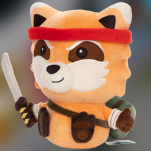

# 🧸 Naninhas Mod

## Project Zomboid Plushie Buffs

  

> **Naninha** is a Portuguese term for a child's comfort plushie or emotional support toy, the kind of soft companion many children keep close for reassurance.

This mod adds "naninhas" style bonuses to Authentic Z attachable plushies. Each plushie grants a different bonus while attached to a backpack.

## Requirements

This mod requires one of the **[Authentic Z](https://steamcommunity.com/sharedfiles/filedetails/?id=2335368829)** mods that allow attachable items:

-   Authentic Z (full mod)
-   AuthenticZBackpacks+ (only the backpacks)

## Links

-   [Steam Workshop](https://steamcommunity.com/sharedfiles/filedetails/?id=3624617298)
-   [Nexusmods](https://www.nexusmods.com/projectzomboid/mods/338)
-   [GitHub Repository](https://github.com/dihgg/naninhas)

## 🦸‍♀️ Support!

 

  <strong>Found this mod fun or useful? You can support its development!</strong>

  

## ✊ Buffs

Each plushie grants a unique bonus while attached to your backpack.

| 🧸 **Plushie**              | ✨ **Effect /Buff**                                                                                     |
| --------------------------- | ------------------------------------------------------------------------------------------------------- |
| **🦡 Boris The Badger**     | Grants the `Cat's Eyes` / `NightVision` effect for better night vision                                  |
| **🧸 Doll**                 | Grants `Eagle Eyed` and suppresses `Short Sighted`                                                      |
| **🦩 Flamingo**             | Grants `Graceful` and suppresses `Clumsy`                                                               |
| **🐇 Fluffyfoot The Bunny** | Grants `Light Eater` and suppresses `Hearty Appetite`                                                   |
| **🦊 Freddy The Fox**       | Grants `Inconspicuous` and suppresses `Conspicuous`                                                     |
| **🐿️ Furbert The Squirrel** | Grants `Outdoorsman`                                                                                    |
| **👶 Green Sci-Fi Goblin**  | Grants `Fast Learner` and suppresses `Slow Learner`                                                     |
| **🐾 Moley The Mole**       | Adds +2 `Plant Scavenging` XP multiplier while equipped                                                 |
| **🐶 Otis the Pug**         | Grants `Fast Reader` and suppresses `Slow Reader`                                                       |
| **🦔 Pancake The Hedgehog** | Adds +1 `Sprinting` and +1 `Agility` XP multipliers while equipped                                      |
| **🐾 Jacques The Beaver**   | Adds +1 `Woodwork` XP multiplier while equipped                                                         |
| **🦝 Spiffo**               | Periodically restores endurance while equipped                                                          |
| **🐾 Spiffo Blueberry**     | Grants `Low Thirst` and suppresses `High Thirst`                                                        |
| **🍒 Spiffo Cherry**        | Grants `Organized` and suppresses `Disorganized`                                                        |
| **🦝 Spiffo PAWS (Gray)**   | Adds +1 `Nimble`, `Long Blade`, `Small Blade`, `Blunt`, and `Small Blunt` XP multipliers while equipped |
| **❤️ Spiffo Heart**         | Adds +2 `Doctor` / First Aid XP multiplier while equipped                                               |
| **🌈 Spiffo Rainbow**       | Periodically reduces boredom, restores endurance, and reduces fatigue                                   |
| **🎅 Spiffo Santa**         | Periodically reduces boredom                                                                            |
| **🍀 Spiffo Shamrock**      | Adds +5 `Aiming` and +5 `Reloading` XP multipliers while equipped                                       |
| **🐾 Substitution Doll**    | Grants `Brave` and suppresses `Desensitized`, `Cowardly`, `Agoraphobic`, and `Claustrophobic`           |
| **🐻 Toy Bear**             | Periodically reduces panic                                                                              |
| **🐻 Toy Bear (Small)**     | Periodically reduces panic, with a smaller effect than Toy Bear                                         |

---

## 🌎 Translations

Available languages for **Naninhas**

### 🇧🇷 Brazilian Portuguese

-   [Steam workshop](https://steamcommunity.com/sharedfiles/filedetails/?id=3737445801)
-   [Nexusmods](https://www.nexusmods.com/projectzomboid/mods/340)

---

## Documentation

-   [How Naninhas works](docs/architecture.md) — client events, server-side buffs, and synchronization
-   [API for other mods](docs/api.md) — plushie events and their payloads
-   [Translations](docs/translations.md) — source files, Build 42 layout, and translation packages

## Project badges

### Code coverage

| Main                                                                                                                              | Release                                                                                                                                        |
| --------------------------------------------------------------------------------------------------------------------------------- | ---------------------------------------------------------------------------------------------------------------------------------------------- |
|  |  |
