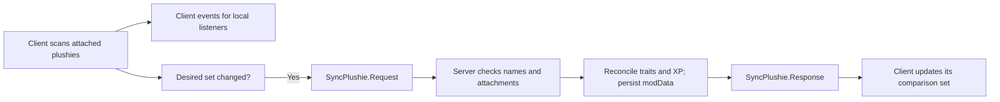

# How Naninhas works

[Documentation index](README.md) · [Project README](../README.md)

Naninhas separates local attachment observation from authoritative buff application. The client scans attached items once per in-game minute. Its observer list emits local equipped, unequipped, and update events for recognized plushies. Separately, the client sends a desired attachment set when that set changes. The server checks the requested names against the player's actual attached items, reconciles traits and XP boosts, persists the result in player `modData`, and replies with accepted and rejected names. This same server-side path is used in single-player.

Client events describe a plushie's configured effects. They do not confirm that the server has applied those effects. See the [API guide](api.md) before consuming them from another mod.

## Transport

The module name is `Naninhas`. The current protocol schema version is `2`. Requests and responses use a common envelope: `schemaVersion`, a per-command `revision`, and `data`. A server handler rejects unsupported schema versions and stale revisions. Revision `1` can start a new stream after reconnect. The client ignores replies with an unsupported schema version.

| Command                | Direction       | `data` fields                                       |
| ---------------------- | --------------- | --------------------------------------------------- |
| `SyncPlushie.Request`  | Client → server | `desiredNames: string[]`                            |
| `SyncPlushie.Response` | Server → client | `appliedNames: string[]`, `rejectedNames: string[]` |

The server rejects unknown names and names that are not attached to the requesting player. These commands are internal synchronization, not a supported way for another mod to grant buffs.

Naninhas also has an internal wake-time temporary buff flow (`SyncSleepBuff.Request` and `SyncSleepBuff.Response`). The client proposes nearby plushies when a player wakes; the server evaluates the candidate and its duration. The server's minute tick expires temporary buffs. This flow is distinct from attached-plushie synchronization.

## Persisted state

The server stores protocol bookkeeping and authoritative effects under the player's `Naninhas` modData key. Persisted state is normalized and migrated when loaded. Network schema checks and save-data migration serve different purposes: an incompatible message is rejected, while older saved state is reshaped for the current runtime. Other mods should use documented events rather than editing this internal state.

Source: [`src/client/components/Naninhas.ts`](../src/client/components/Naninhas.ts), [`src/client/components/PlushieSyncPublisher.ts`](../src/client/components/PlushieSyncPublisher.ts), [`src/server/components/NaninhasCommandHandler.ts`](../src/server/components/NaninhasCommandHandler.ts), and [`src/server/components/CommandHandler.ts`](../src/server/components/CommandHandler.ts).
